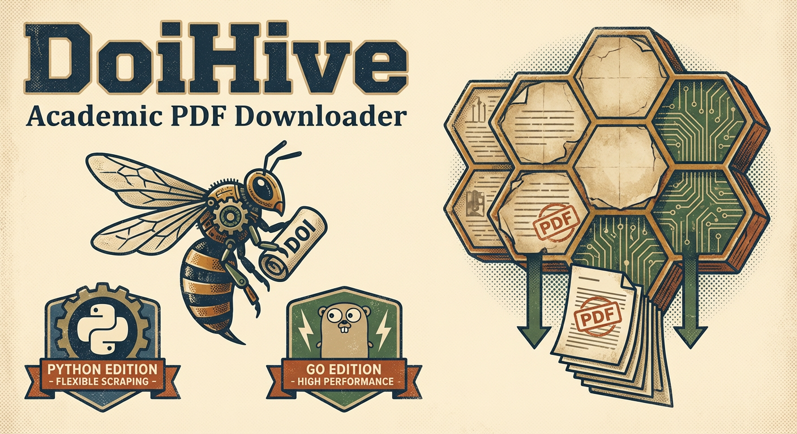

# 🐝 DoiHive


> **一个跨语言（Python/Go）的学术 PDF 批量下载工具**
>
> 目前支持从 Web of Science (WoS) 导出的 TXT 文件中提取 DOI，并通过 Sci-Hub 下载 PDF

[English](README.md) • [中文文档](README_zh.md)

---

## 项目简介

DoiHive 自动化了从文献数据文件中提取 DOI 并下载对应 PDF 的过程。项目最终目标是支持从搜索查询自动获取 DOI，但目前专注于处理已有的 DOI 数据。

**当前状态**：Python 和 Go 实现均已完成核心功能。Go 版本在大规模下载场景下性能更优。



> **愿景**：`🔍 主题 → 🐝 OpenAlex → 🏠 DOI 列表 → 🍯 Sci-Hub → 🌾 收割 → 📄 PDF → 🤖 AI 管线`
>
> 自动化学术文献采集：从主题检索到 AI 训练数据的端到端解决方案

## 功能特性

- ✅ 从 WoS TXT 文件提取 DOI，批量下载 PDF
- ✅ **反爬机制**：浏览器请求头、随机延迟、自动重试
- ✅ **DOI 缓存**：断点续传，跳过已处理的 DOI
- ✅ **安全收割**：渐进式下载，异常自动停止
- ✅ **实时进度**：进度条、统计信息、日志持久化

## 技术栈


- **Python 3.13+** - 基础实现
- **Go 1.25+** - 高性能实现（推荐）

### 性能对比

| 指标 | Python | Go (默认 3 workers) |
| ------ | -------- | ----- |
| 单任务耗时 | - | ~2-3s |
| 并发模型 | 单线程 | Goroutines |
| 吞吐量 | - | ~0.5 DOI/s |
| 缓存/反爬 | ❌ | ✅ |
| 推荐场景 | 小规模测试 | 大规模批量下载 |

> ⚠️ Python 版本未实现缓存和反爬机制，不建议用于大规模下载

## 安装

### 前置要求

**Python 版本：**

- Python 3.13 或更高版本
- [uv](https://github.com/astral-sh/uv)（推荐）或 pip

**Go 版本：**

- Go 1.25 或更高版本

### 设置

1. 克隆仓库：

    ```bash
    git clone https://github.com/SJRnhqh/DoiHive.git
    cd DoiHive
    ```

2. **Python 版本**：使用 uv 安装依赖：

    ```bash
    uv sync
    ```

    或使用 pip：

    ```bash
    pip install -e .
    ```

3. **Go 版本**：安装依赖：

    ```bash
    go mod download
    ```

    编译可执行文件：

    ```bash
    ./build.sh
    ```

    或手动编译：

    ```bash
    go build -o bin/doihive ./cmd
    ```

## 使用方法

### Python 实现

1. **准备 WoS TXT 文件**：将 Web of Science 导出的 TXT 文件放置在 `archive/` 目录中。

2. **运行脚本**：

    ```bash
    cd python
    python main.py
    ```

3. **输出**：
   - PDF 文件保存到 `pdf/` 目录
   - 错误日志保存到 `error/` 目录（JSON 格式）
   - 应用日志保存到 `logs/` 目录

### Go 实现（推荐）

```bash
./bin/doihive-darwin-arm64 -a archive -b 100 -w 2
```

| 参数 | 说明 | 默认值 |
| ------ | ------ | -------- |
| `-a` | Archive 目录（必需） | - |
| `-b` | 限制下载数量（0=全部） | 0 |
| `-w` | 并发 workers 数 | 3 |
| `-pdf` | PDF 输出目录 | ./pdf |

**输出目录**：`pdf/`（PDF）、`pdf/logs/`（日志）、`pdf/debug/`（调试）

### 安全收割（大规模下载推荐）

```bash
./scripts/harvest.sh -a ./archive                    # 默认参数
./scripts/harvest.sh -a ./archive -b 50 -r 10        # 每批50个，共10轮
```

| 参数 | 说明 | 默认值 |
| ------ | ------ | -------- |
| `-a` | Archive 目录（必需） | - |
| `-b` | 每批下载数量 | 30 |
| `-r` | 最大轮数（0=无限制） | 0 |
| `-w` | 并发 workers 数 | 2 |
| `-d` | 批次间最小等待秒数 | 60 |
| `-D` | 批次间最大等待秒数 | 180 |

## 项目结构

```txt
DoiHive/
├── python/                 # Python 实现
│   ├── main.py            # 主入口点
│   └── utils/             # 工具模块
│       ├── analyze.py     # DOI 提取和验证
│       ├── hive.py        # PDF 下载逻辑
│       └── logger.py      # 日志配置
├── cmd/                   # Go 实现
│   └── main.go            # 主入口点（CLI）
├── core/                  # Go 核心逻辑
│   ├── check.go           # DOI 检查和提取
│   ├── hive.go            # PDF 下载逻辑（含缓存和反爬）
│   └── logger.go          # 日志持久化
├── scripts/               # 自动化脚本
│   └── harvest.sh         # 安全渐进式批量下载脚本
├── bin/                   # 编译后的二进制文件（生成）
├── archive/               # 输入：WoS TXT 文件
├── pdf/                   # 输出：下载的 PDF
│   ├── downloaded.txt     # 缓存：已成功下载的 DOI
│   ├── not_available.txt  # 缓存：Sci-Hub 上不可用的 DOI
│   ├── logs/              # 输出：下载日志（Go）
│   └── debug/             # 输出：调试 HTML 文件
├── error/                 # 输出：错误日志（Python）
├── logs/                  # 输出：应用日志（Python）
├── build.sh               # 跨平台编译脚本
├── pyproject.toml         # Python 依赖
└── go.mod                 # Go 依赖
```

## 开发路线图

### ✅ 已完成

- [x] WoS TXT 文件 DOI 提取与验证
- [x] Sci-Hub 批量下载（Python/Go 双实现）
- [x] 反爬机制：浏览器头、随机延迟、自动重试
- [x] DOI 缓存与断点续传
- [x] 安全收割脚本（渐进式下载）
- [x] 实时进度条与日志持久化

### 🚧 计划中

- [ ] 多 Sci-Hub 镜像支持
- [ ] 其他文献数据源支持
- [ ] 配置文件支持

## 贡献

欢迎贡献！请随时提交 Pull Request。

## 免责声明

本工具仅用于教育和研究目的。下载学术论文时，请遵守版权法和出版商的服务条款。
